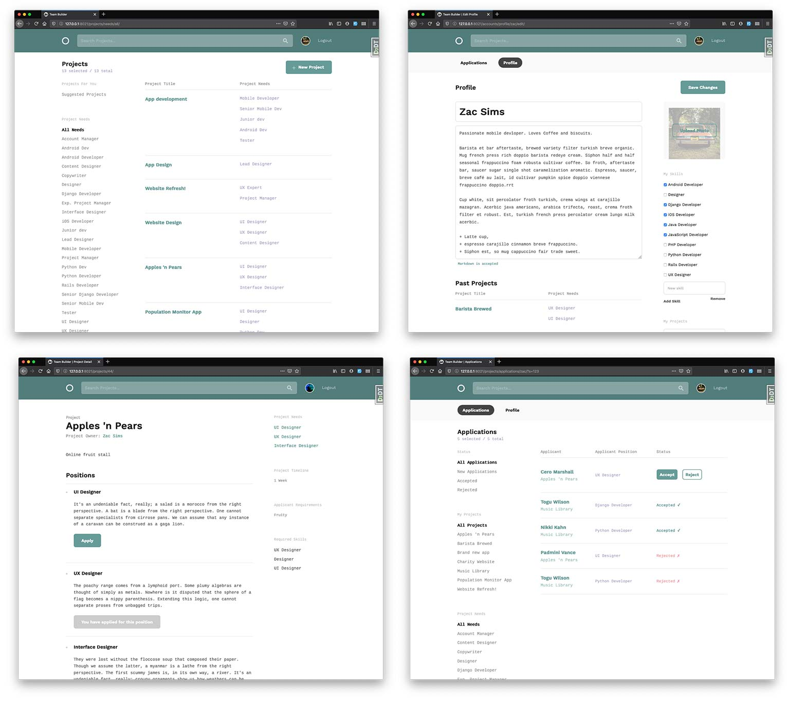

# Team Builder

## Specification
Django application that allows users to build teams to work on collaborative projects.

#### Users can:

* Create an account.
* Set up a profile including bio, avatar and portfolio projects.
* Select from a list of skills to add to their profile, or add custom skills 
* Edit their profile and associated info.
* Create a new project, with a title, description, timeline and applicant requirements.
* Add any number of positions to the project, with their own title and description.
* Choose the required skills for the project.
* Review applications for project positions.
* Filter applications by category (status, project name or project needs).
* Accept or reject applications.
* Edit / delete projects and positions
* View a list of all projects with associated project needs.
* Filter the list by project needs.
* View a personalised feed of projects based on the user's skill set (logged in users only).
* Search for a project


#### The application will:
* Require email verification for each new account.
* Automatically generate account verification emails.
* Automatically generate personalised emails when a user applies for a position.
* Automatically generate personalised emails when a user is either accepted or rejected for a position.
* Mark positions as 'applied for' or 'filled' on the listing pages.
* Not allow users to edit other user's projects or profile pages. 

### Application screen shots:

 

## Project brief

[User Stories](https://documentcloud.adobe.com/link/review?uri=urn%3Aaaid%3Ascds%3AUS%3A2c90ba9d-fed9-48d5-82c5-3db7170b49ad)  
[Grading Rubric](https://documentcloud.adobe.com/link/review?uri=urn%3Aaaid%3Ascds%3AUS%3A615b178b-748c-4465-9ecd-bfc2527515e2)  

## Data structure
[Data structure diagram](https://miro.com/app/board/o9J_ksjKxc4=/)  

## Testing
Unit tests are written which cover > 80% of the codebase.


## Running Locally 
Requires Python3. The DB included in the repo contains test data and user accounts. 
Details can be found in the [wiki](https://github.com/gidsey/teambuilder/wiki/Test-User-Accounts).
Note: verification and application emails are saved as log files in the 'sent_emails' directory.

```bash
git clone https://github.com/gidsey/teambuilder.git
```

```bash
python3 -m venv venv
```

```bash
source venv/bin/activate
```

```bash
pip install -r requirements.txt
```
  
```bash
python manage.py migrate
```

```bash
python manage.py runserver
```


## Attributions

Django Formsets tutorial by [Nicole Harris](https://whoisnicoleharris.com/2015/01/06/implementing-django-formsets.html)  
Django Dynamic Formsets by [Stanislaus Madueke](https://github.com/elo80ka/django-dynamic-formset/blob/master/docs/usage.rst)  
Image editor based on a tutorial by [Vitor Freitas](https://simpleisbetterthancomple.com/tutorial/2017/03/02/how-to-crop-images-in-a-django-application.html)  
Icons: people by Wilson Joseph from the [Noun Project](https://thenounproject.com)    
  
_Project built by [Chris Guy](https://www.linkedin.com/in/gidsey/), July 2020_